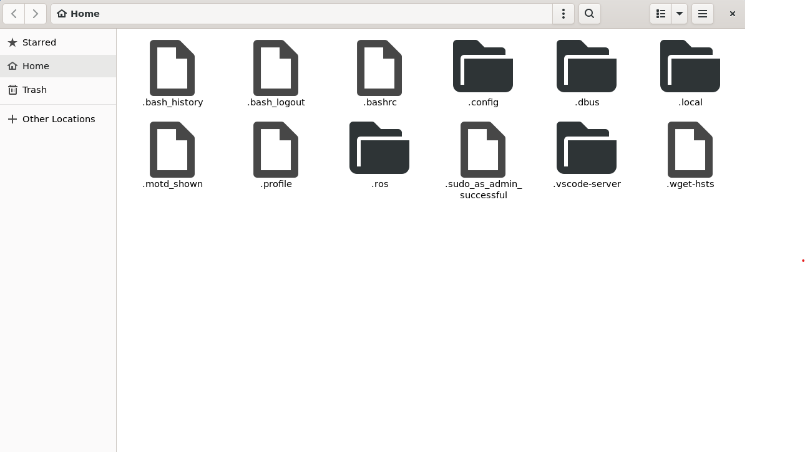

# ubuntu-ros2-setup

## METR4202 Practical 1

0. If you are using a Windows machine, follow the instructions on how to install Ubuntu 22.04 Jammy Jellyfish using either [WSL2](WSL_setup) or [VirtualBox](VirtualBox_setup).
1. [Install ROS2 Humble Hawksbill and Classic Gazebo](ros2_humble_install/README.md).
2. Start working in ROS2 and Gazebo by following the [ROS2 Exercises and Quick Guide](ros2/README.md)

### Some useful packages and applications for this course:
If you have [VS Code](https://code.visualstudio.com/) you can simply run this command in any directory to open an instance of VS Code.
```
code .
```
Alternatively you can use any Linux compatible IDE or even VIM if you are brave.

We also recommend installing **nautilus**, the default gnome file browser.

```
sudo apt install nautilus
nautilus
```


You should see a window appear that looks like this. Use **CTRL+H** to show hidden files.