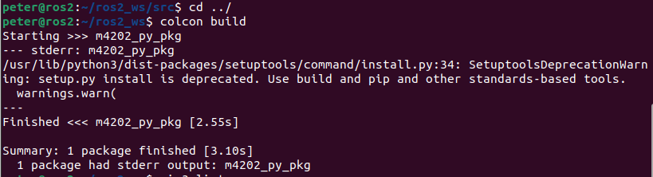
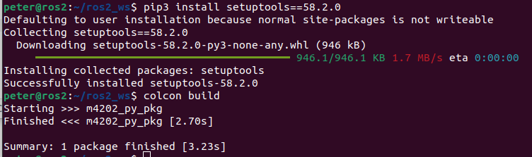
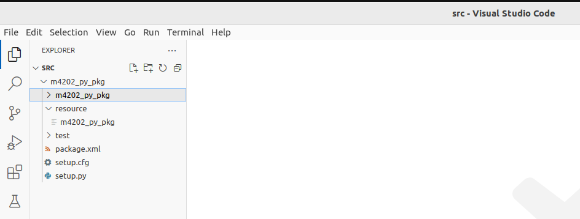
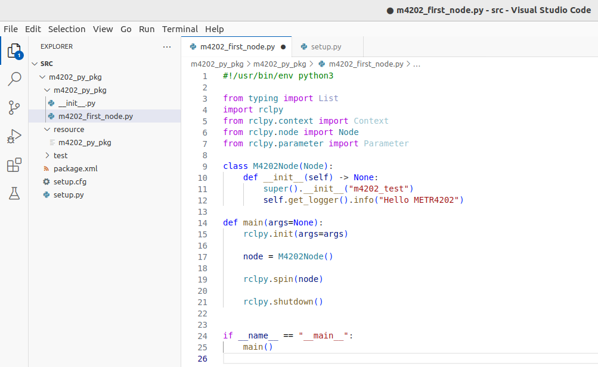
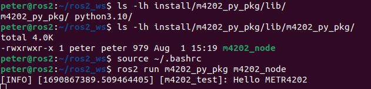

# Create a Python Package

### Create a New Workspace

Start by creating a new workspace:

    cd ~/
    mkdir -p ros2_ws/src
    cd ros2_ws
    
    colcon build
    
    ls -lh

The build should be successful, and you should see folders `build`, `install`, `log` and `src`.

Now see what is in the `install` folder:
    
    ls -lh install/

These are similar to the global setups in `/opt/ros/humble/`, but are specific to your workspace that you have just created.
You will need to source the `setup.bash`:

    source install/setup.bash

As before you should add this to your `.bashrc` file to be sourced every time you open a new terminal. To do that, open the `~/.bashrc` file in your favourite editor and add the following line at the end of the file.
You can also run the following command:

    echo 'source ~/ros2_ws/install/setup.bash' >> ~/.bashrc

### Create a New Python Package

    cd ~/ros2_ws/src
    ros2 pkg create m4202_py_pkg --build-type ament_python --dependencies rclpy

    ls

You should see `m4202_py_pkg` folder.

To build the package, you need to move up to the `ros2_ws` folder and run `colcon build`:

    cd ../
    colcon build
    
And you should see the following error message (if the build was successful, ignore the next paragraph):

To fix this, you will need to downgrade the `setuptools` package:

    sudo apt install python3-pip
    
    pip3 install setuptools==58.2.0
    
Running the build again now be successful:

    colcon build
    

To build only a single package run:

    colcon build --packages-select m4202_py_pkg
    
Open the `ros2_ws/src` folder in the VSCode:

### Create a New Node

Now create a new file `m4202_first_node.py` in the `src/m4202_py_pkg/m4202_py_pkg` folder and add the following content:

    #!/usr/bin/env python3

    from typing import List
    import rclpy
    from rclpy.context import Context
    from rclpy.node import Node
    from rclpy.parameter import Parameter

    class M4202Node(Node):
        def __init__(self) -> None:
        super().__init__("m4202_test")
        self.get_logger().info("Hello METR4202")

    def main(args=None):
        rclpy.init(args=args)

        node = M4202Node()

        rclpy.spin(node)

        rclpy.shutdown()

    if __name__ == "__main__":
        main()
        
    
It should look like this:

Now you can build and install the node. To do that update the `setup.py`, section `entry_points`. Update it to the following:

        entry_points={
        'console_scripts': [
            "m4202_node = m4202_py_pkg.m4202_first_node:main"
        ],
        },
        
### Running and Building the Node

Now go back to the `ros2_ws` and use `colcon build` to build the package:

    cd ~/ros2_ws
    colcon build --packages-select m4202_py_pkg
    
After successful build, you should be able to see the installed node in the install folder:

    ls -lh install/m4202_py_pkg/lib/m4202_py_pkg/
    
    # should show: m4202_node
    
Now you can run your new node. Before running re-source the `.bashrc`:

    source ~/.bashrc
    
    ros2 run m4202_py_pkg m4202_node
    
    
    

