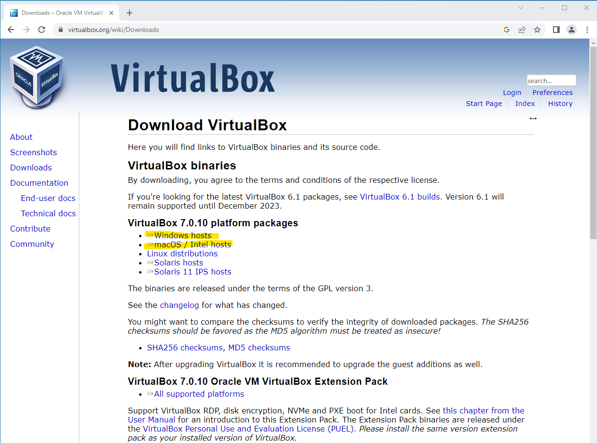
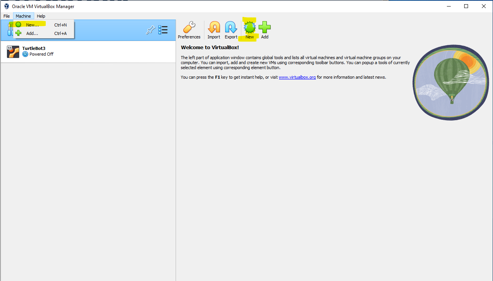
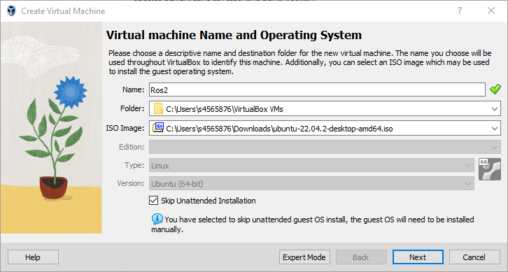
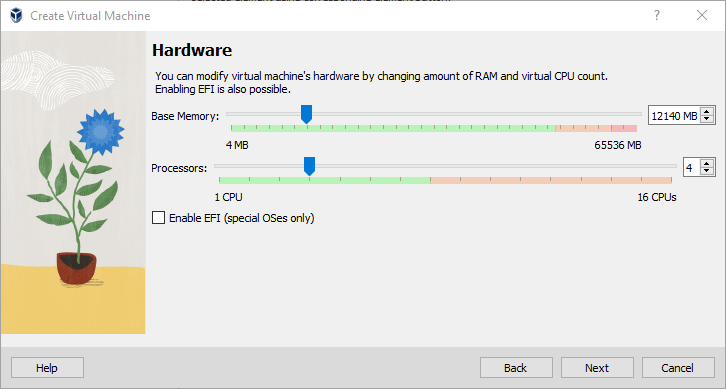
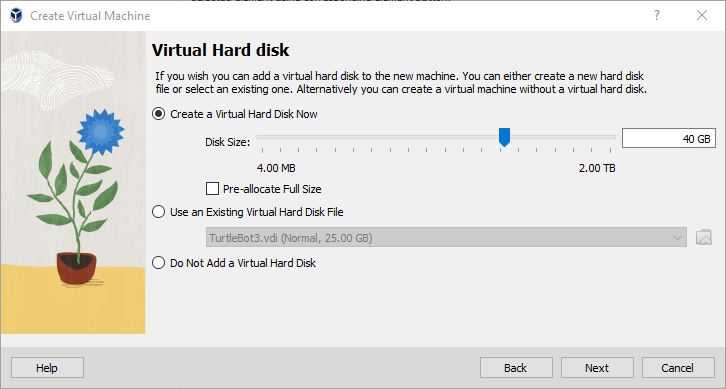
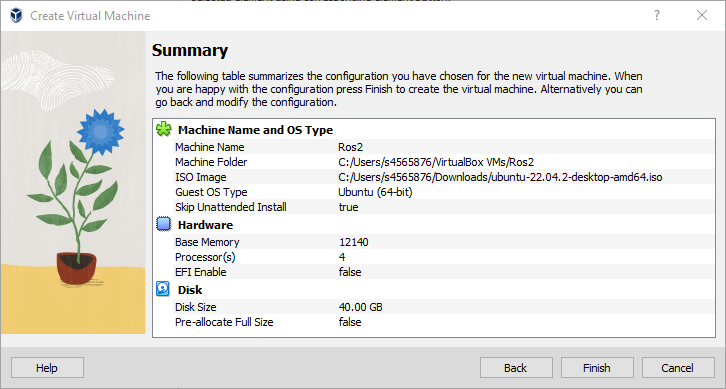

## Install VirtualBox

The first step is to install the VirtualBox. The installation files can be downloaded from [https://www.virtualbox.org/wiki/Downloads](https://www.virtualbox.org/wiki/Downloads):

Once downloaded, run the installation.

## Setup the Virtual Machine and Install Ubuntu

There are several steps required. You will need to first create a new virtual machine (VM) and then install the Ubuntu operating system.

### Download Ubuntu 22.04
You will need the installation disk for Ubuntu 22.04 Desktop Edition. There are many editions and versions, so make sure you download the correct one.
It can be downloaded from [here](https://releases.ubuntu.com/jammy/) or you can just click this link: [https://releases.ubuntu.com/jammy/ubuntu-22.04.2-desktop-amd64.iso](https://releases.ubuntu.com/jammy/ubuntu-22.04.2-desktop-amd64.iso).

### Setup the Virtual Machine

Open the VirtualBox and click new (either click the button or select from the menu):

and follow the steps:

Enter the name for the new VM (this can be anything).
In the `ISO Image` field find the Ubuntu installation disk that you downloaded in the previous step.
Tick `Skip Unattended Installation` and click `Next`:

Now specify the resources to be used by the VM. For reasonable performance, you will need around 12-16GB of base memory and at least 2 CPUs.
The actual resources depend on how much memory and CPUs are available on your computer.

Setup the hard disk. Again, this will depend on the available space on your hard disk.
You will need at least 25GB (the OS + ROS installation will take up around 15GB + you need some space for the workspace and additional ROS packages).

Click finish and your VM will be created:

