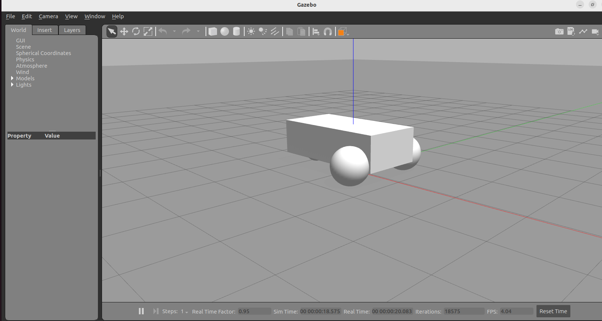
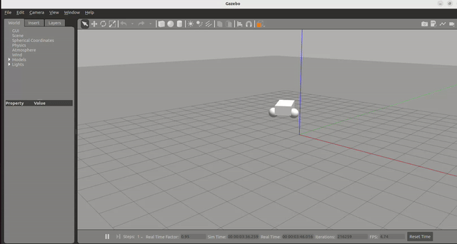

# Start Gazebo

This loosely follows the [following tutorial](https://classic.gazebosim.org/tutorials?tut=ros2_installing&cat=connect_ros).

	
Now install `gazebo_ros_pkgs`:

	sudo apt install ros-humble-gazebo-ros-pkgs
	
	
Load the differential drive world with Gazebo:

	gazebo --verbose /opt/ros/humble/share/gazebo_plugins/worlds/gazebo_ros_diff_drive_demo.world
	
You should see the Gazebo screen open up:

In the next window run the following command:

	ros2 topic pub /demo/cmd_demo geometry_msgs/Twist '{linear: {x: 1.0}, angular: {z: 0.2}}' -1
	
And you should see the robot moving:

