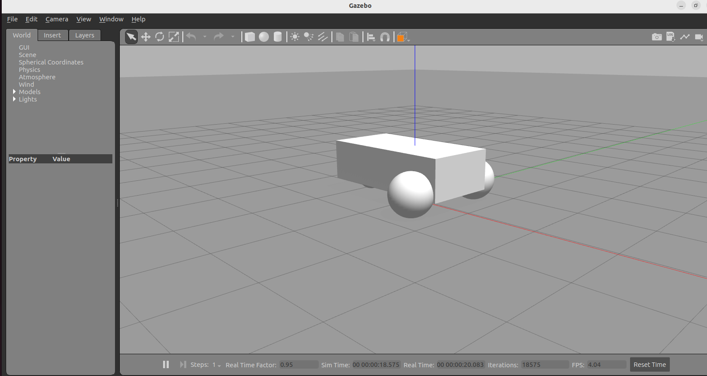
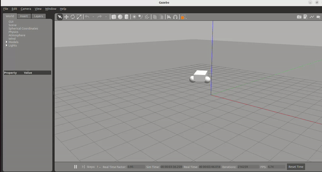

# Gazebo Demo
	
Load the differential drive world with Gazebo:

	gazebo --verbose /opt/ros/humble/share/gazebo_plugins/worlds/gazebo_ros_diff_drive_demo.world
	
You should see the Gazebo window open up with a simple differential drive robot:

To make the robot move, we can send it velocity commands. Since it is a differential drive robot, we can send a forward linear velocity and an angular rotation (yaw/heading change).

The robot controllers are subscribing to the topic `/demo/cmd_demo` which is a `geometry_msgs/Twist` message type. You can find all the message type definitions in the [online documentation](https://docs.ros2.org/foxy/api/geometry_msgs/msg/Twist.html).

In a new terminal run the following command to publish a single forward velocity command of 1 m/s and an angular turn rate command of 0.2 rad/s:

	ros2 topic pub /demo/cmd_demo geometry_msgs/Twist '{linear: {x: 1.0}, angular: {z: 0.2}}' -1
	
You should see the robot moving:

## Next

Return to the [README](README.md) for more exercises.
