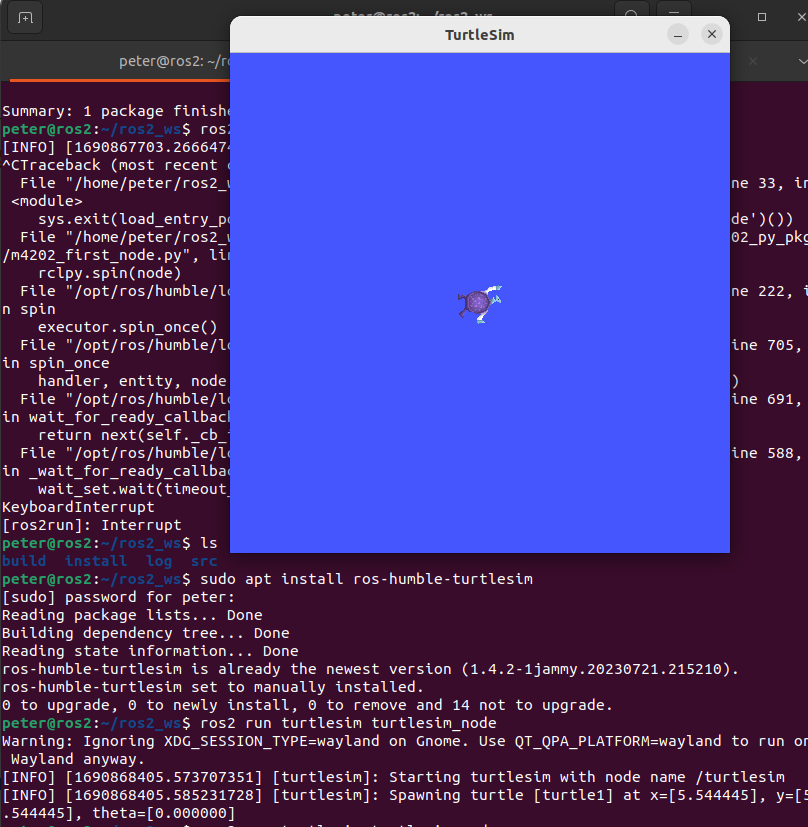

# ROS2 TurtleSim

To install the TurtleSim:

	sudo apt install ros-humble-turtlesim
	
To run:

	ros2 run turtlesim turtlesim_node
	
And this should be the result:

In a second terminal window run:

	ros2 run turtlesim turtle_teleop_key

## Next

Return to the [README](README.md) for more exercises.
