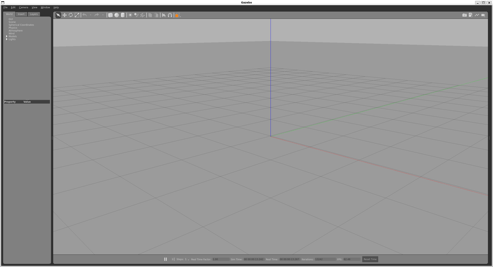

# Install Gazebo

Additional documentation can be found on the Gazebo Classic [website](https://classic.gazebosim.org/tutorials?tut=ros2_installing&cat=connect_ros).

Open a terminal, install Gazebo and all dependent packages using the following command. Note that the * indicates all packages that have the same prefix.

```
sudo apt install ros-humble-gazebo-*
```

Set the Gazebo model path using:

```
export GAZEBO_MODEL_PATH=~/.gazebo/models:$GAZEBO_MODEL_PATH
```

Or alternatively, add it to your .bashrc file so that it is automatically called whenever you open a new terminal.

```
echo 'export GAZEBO_MODEL_PATH=~/.gazebo/models:$GAZEBO_MODEL_PATH' >> ~/.bashrc
```

You can now launch Gazebo from the command line. The `verbose` flag is optional and will print out additional information to the command line, which can be useful for debugging.

```
gazebo --verbose
```

You should see an empty simulation world as follows:



## Notes and Tips

The first time you launch Gazebo it can take a while to start because it needs to download all of the object models.

In general, Gazebo can be a bit temperamental. If it doesn't load the first time, try the following:

* Hit `CTRL+C`, wait for the process to exit and run again
* Kill all Gazebo processes `killall -s SIGKILL gzclient gzserver` and run again
* If neither of the above work, try sourcing `source /usr/share/gazebo/setup.sh`. If this solves the problem, include the call in your .bashrc file.
