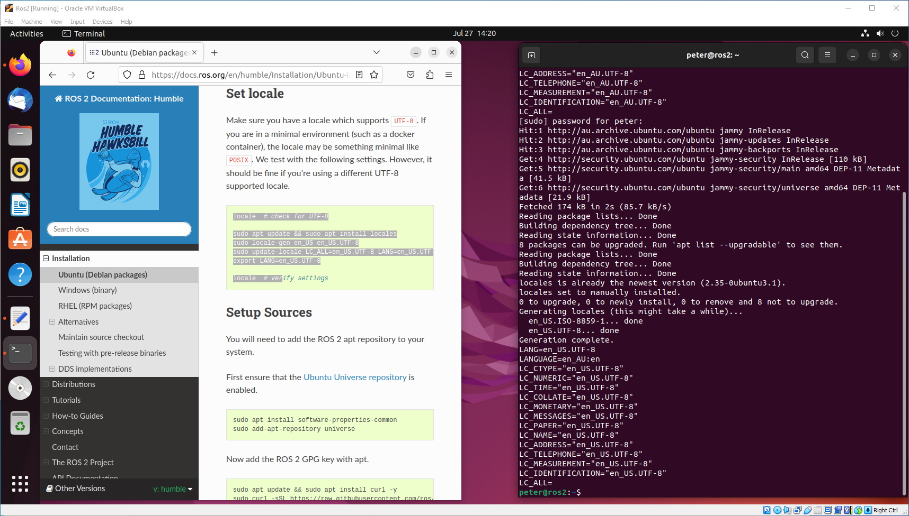
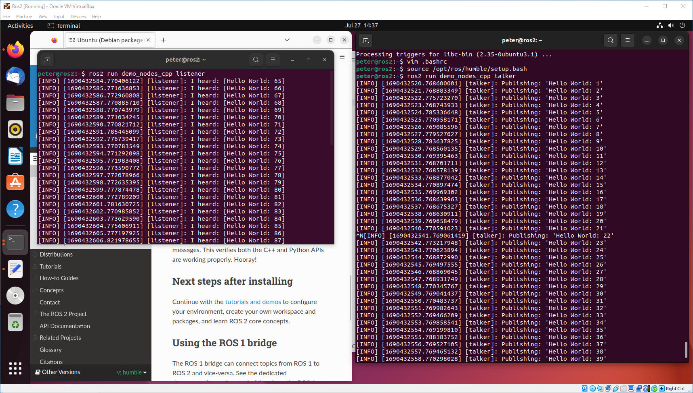

## Install ROS2 Humble

Full documentation and instructions on the ROS website: [https://docs.ros.org/en/humble/Installation/Ubuntu-Install-Debians.html](https://docs.ros.org/en/humble/Installation/Ubuntu-Install-Debians.html).

The relevant installation steps as of 2024 are below and can be copied and pasted into the command line. Please check the ROS website in case there are updates.

## Set locale

    locale  # check for UTF-8

    sudo apt update && sudo apt install locales
    sudo locale-gen en_US en_US.UTF-8
    sudo update-locale LC_ALL=en_US.UTF-8 LANG=en_US.UTF-8
    export LANG=en_US.UTF-8
    
    locale  # verify settings

## Setup sources

Enable Universe repository:

    sudo apt install software-properties-common
    sudo add-apt-repository universe

Add the GPG key and ROS2 source:

    sudo apt update && sudo apt install curl -y
    sudo curl -sSL https://raw.githubusercontent.com/ros/rosdistro/master/ros.key -o /usr/share/keyrings/ros-archive-keyring.gpg

    echo "deb [arch=$(dpkg --print-architecture) signed-by=/usr/share/keyrings/ros-archive-keyring.gpg] http://packages.ros.org/ros2/ubuntu $(. /etc/os-release && echo $UBUNTU_CODENAME) main" | sudo tee /etc/apt/sources.list.d/ros2.list > /dev/null

## Install ROS2:

    sudo apt update
    sudo apt install ros-humble-desktop
    sudo apt install ros-dev-tools

## Test the installation

You will need 2 terminal windows (press `CTRL+SHIFT+N` to open a second window or `CTRL+SHIFT+T` to open a new tab).

In the first terminal type:

    source /opt/ros/humble/setup.bash
    ros2 run demo_nodes_cpp talker

In the second terminal type:

    source /opt/ros/humble/setup.bash
    ros2 run demo_nodes_py listener

You should now see the following:

The talker node is publishing `Hello world` messages and the listener node is receiving them.

## Source your ROS installation

Rather than running the line `source /opt/ros/humble/setup.bash` every time you open a new terminal, you can add it to your .bashrc file:

    echo 'source /opt/ros/humble/setup.bash' >> ~/.bashrc

This will add that line at the end of the .bashrc file. Now it will be automatically sourced every time you open a new terminal.
