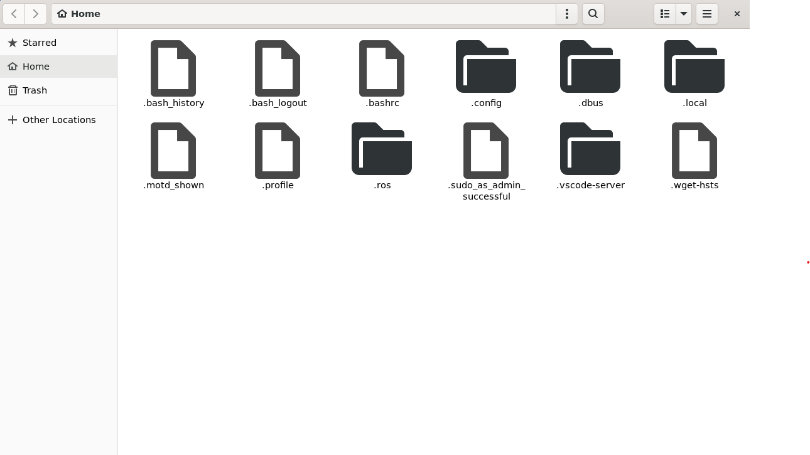

### ROS2 Humble Installation and Setup:
Find full docs [here](https://docs.ros.org/en/humble/Installation/Ubuntu-Install-Debians.html).

Ensure Ubuntu Universe repo is enabled:
```
sudo apt install software-properties-common
sudo add-apt-repository universe
```
Add the ROS 2 GPG key:
```
sudo apt update && sudo apt install curl -y
sudo curl -sSL https://raw.githubusercontent.com/ros/rosdistro/master/ros.key -o /usr/share/keyrings/ros-archive-keyring.gpg
```

Add repo to your sources list:
```
echo "deb [arch=$(dpkg --print-architecture) signed-by=/usr/share/keyrings/ros-archive-keyring.gpg] http://packages.ros.org/ros2/ubuntu $(. /etc/os-release && echo $UBUNTU_CODENAME) main" | sudo tee /etc/apt/sources.list.d/ros2.list > /dev/null
```

Now update the system:
```
sudo apt update
sudo apt upgrade
```

Finally you can install ROS 2, we are using humble for this course as it is the latest LTS:
```
sudo apt install ros-humble-desktop
```
Also install the dev tools:
```
sudo apt install ros-dev-tools
```

### Finally test the install to ensure it is correct
In your terminal run:
```
source /opt/ros/humble/setup.bash
ros2 run demo_nodes_cpp talker
```
Then open another terminal and run:
```
source /opt/ros/humble/setup.bash
ros2 run demo_nodes_py listener
```
You are now done.

## Some useful packages and applications for this course:
If you have [VS code](https://code.visualstudio.com/) you can simply run this command in any directory to open an instance of VS code this is linked to WSL.
```
code .
```
Alternatively you can use any Linux compatible IDE or even VIM if you are brave.

Some additional packages I would recommend are:
* Nautilus, this is the default gnome files browser
```
sudo apt install nautilus
nautilus
```

You should see a window appear that looks like this. Use **ctrl+h** to show hidden files.