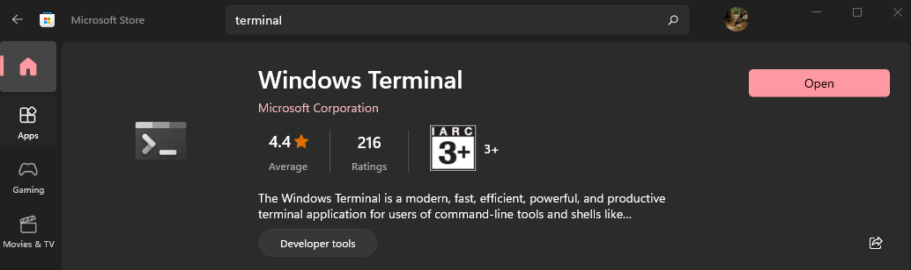
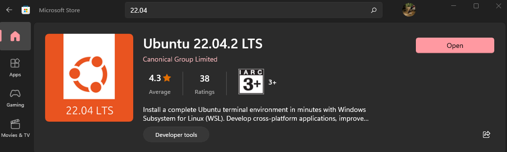
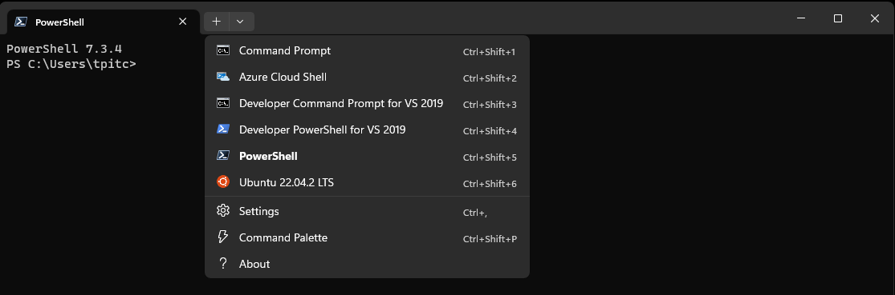

# METR4202
## Setting up WSL2 and ROS 2 on windows 11:

Requirements:
* Windows 11, you may try on Windows 10 but it is very hit and miss: [Requirements](https://learn.microsoft.com/en-us/windows/wsl/install).

### WSL2 and Ubuntu 22.04 install:

First install windows terminal from the microsoft store:


Install WSL2 using powershell:
```
wsl --install
```
Navigate back to the microsoft store and install Ubuntu 22.04 LTS



The dropdown menu in Windows Terminal should now have Ubuntu as an option (you make have to close and reopen):

Click this and WSL will begin the installation process, follow this and Ubuntu 22.04 will be set up.

Please make sure to update regularly:
```
sudo apt update
sudo apt upgrade
```

### FYI
* Get used to using the command line/terminal, this is where you will be debugging. 
* **sudo** give root (admin) privileges to a command
* **apt** is a package manager 
